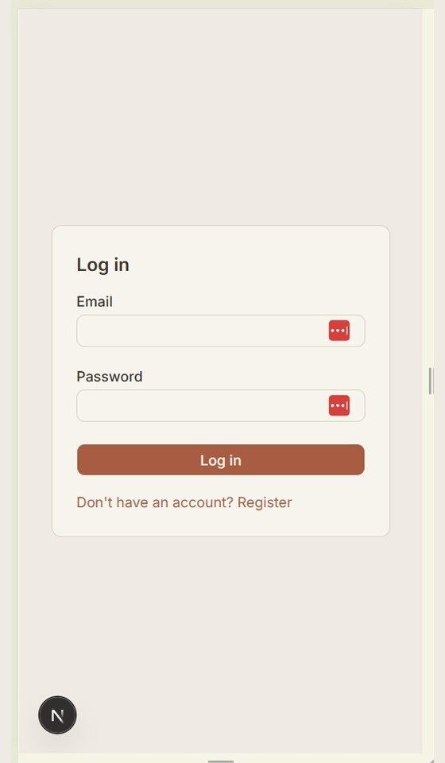
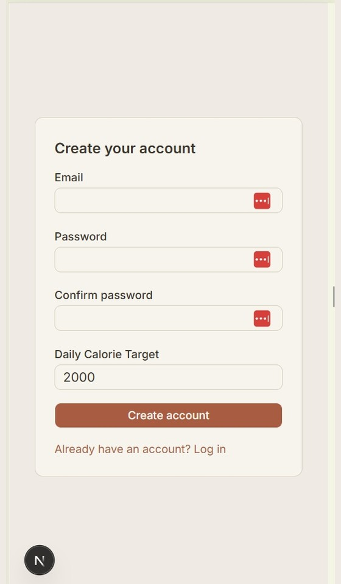
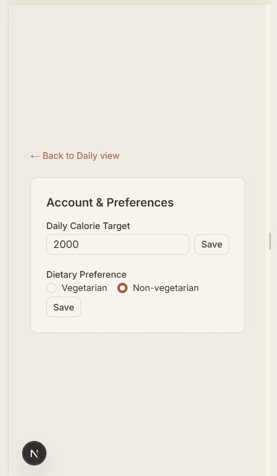
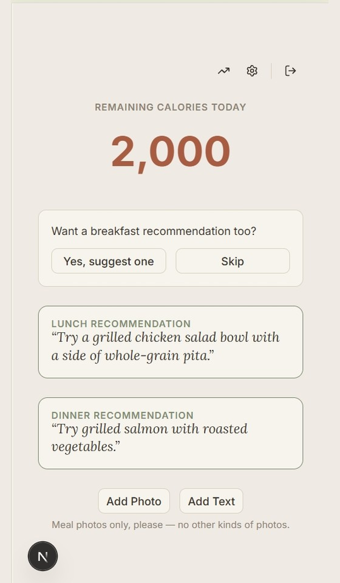
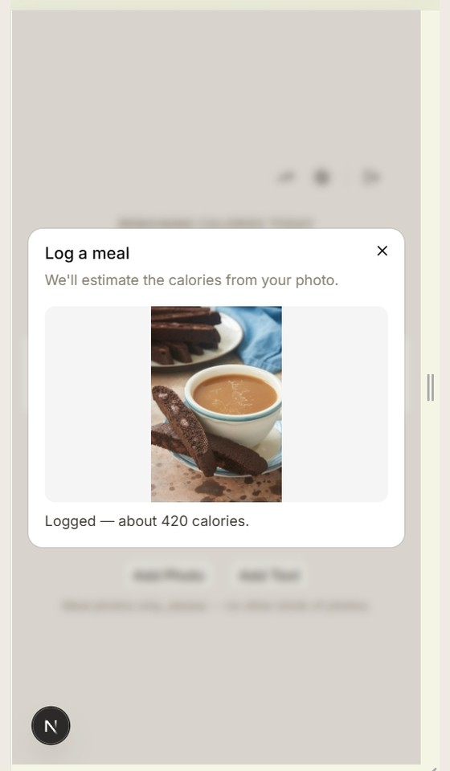
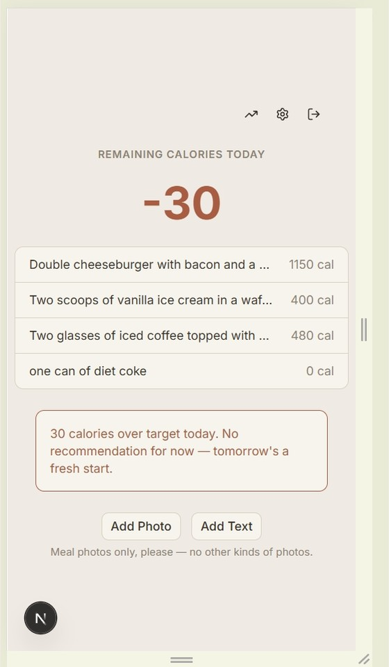
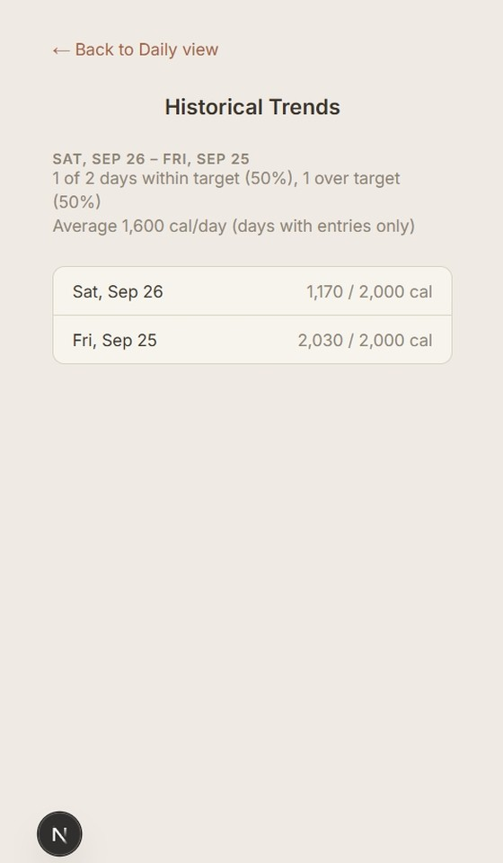

# Calorie Tracker MVP

A solo-use, web-based prototype for tracking daily calorie intake. Log a meal by snapping a photo or typing a quick description, and within seconds get an estimated calorie count, your remaining calorie budget for the day, and a concrete recommendation for what to eat next — no manual math, no social features. Built with Next.js and Supabase.

## Documentation

- [Architecture](_bmad-output/planning-artifacts/architecture/architecture-bmad-calorie-counter-2026-09-16/ARCHITECTURE-SPINE.md)
- [PRD](_bmad-output/planning-artifacts/prds/prd-bmad-calorie-counter-2026-09-15/prd.md)
- [Experience](_bmad-output/planning-artifacts/ux-designs/ux-bmad-calorie-counter-2026-09-18/EXPERIENCE.md)
- [Epics](_bmad-output/planning-artifacts/epics.md)

## Screenshots

<table>
<tr>
<td width="50%">

**Log in**



</td>
<td width="50%">

**Create an account**



</td>
</tr>
<tr>
<td width="50%">

**Account & Preferences**



</td>
<td width="50%">

**First login of the day**



</td>
</tr>
<tr>
<td width="50%">

**Log a meal via photo**



</td>
<td width="50%">

**End of day (over budget)**



</td>
</tr>
<tr>
<td width="50%">

**Historical trends**



</td>
<td width="50%"></td>
</tr>
</table>

## Getting Started

This is a [Next.js](https://nextjs.org) project bootstrapped with [`create-next-app`](https://nextjs.org/docs/app/api-reference/cli/create-next-app).

First, run the development server:

```bash
npm run dev
# or
yarn dev
# or
pnpm dev
# or
bun dev
```

Open [http://localhost:3000](http://localhost:3000) with your browser to see the result.

You can start editing the page by modifying `app/page.tsx`. The page auto-updates as you edit the file.

This project uses [`next/font`](https://nextjs.org/docs/app/building-your-application/optimizing/fonts) to automatically optimize and load [Geist](https://vercel.com/font), a new font family for Vercel.

## Learn More

To learn more about Next.js, take a look at the following resources:

- [Next.js Documentation](https://nextjs.org/docs) - learn about Next.js features and API.
- [Learn Next.js](https://nextjs.org/learn) - an interactive Next.js tutorial.

You can check out [the Next.js GitHub repository](https://github.com/vercel/next.js) - your feedback and contributions are welcome!

## Deploy on Vercel

The easiest way to deploy your Next.js app is to use the [Vercel Platform](https://vercel.com/new?utm_medium=default-template&filter=next.js&utm_source=create-next-app&utm_campaign=create-next-app-readme) from the creators of Next.js.

Check out our [Next.js deployment documentation](https://nextjs.org/docs/app/building-your-application/deploying) for more details.
