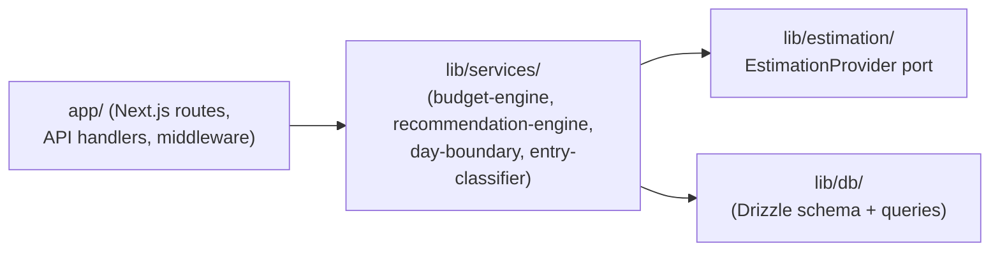
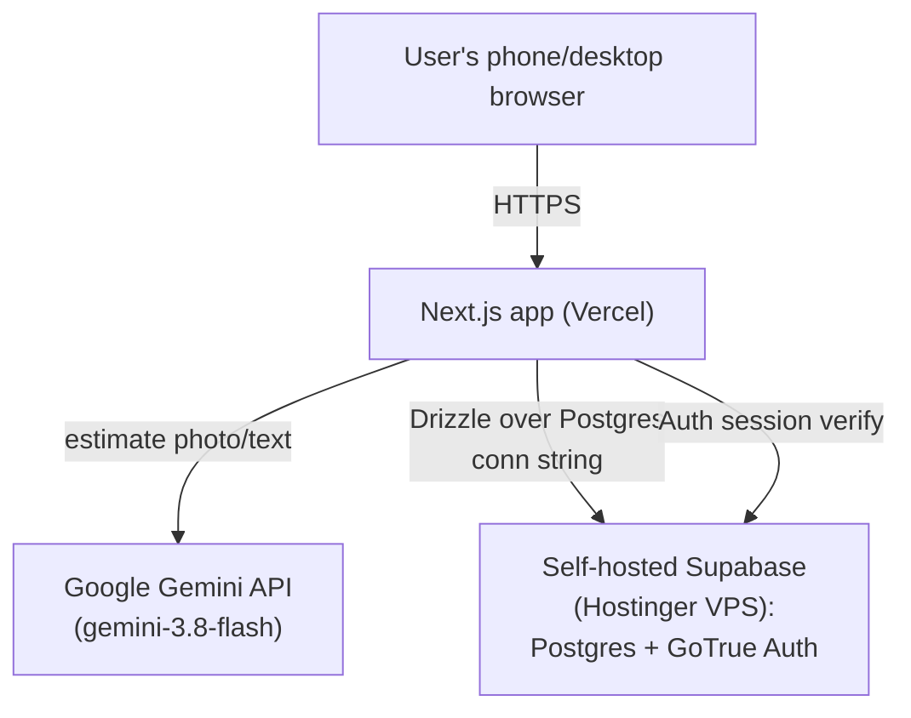
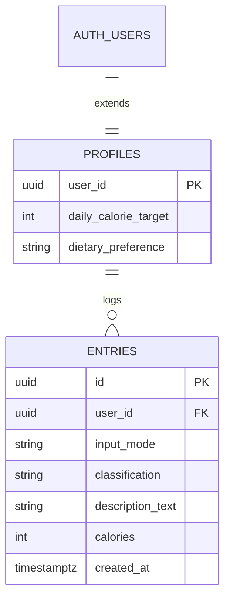

# Architecture Spine — Calorie Tracker MVP

## Design Paradigm

Layered architecture — routes → services → data/estimation — with a single hexagonal seam carved out where a real swap is expected: the Estimation Pipeline.



Everything outside `lib/estimation/` is plain layered — no port/adapter ceremony elsewhere.

## Invariants & Rules

### AD-1 — Layered dependency direction

- **Binds:** all
- **Prevents:** business logic bleeding into route handlers, or a route/component querying the database directly
- **Rule:** routes call services only; services call the DB and estimation layers; no layer is skipped or called in reverse.

### AD-2 — EstimationProvider port `[ADOPTED]`

- **Binds:** FR-2, FR-3, FR-4, FR-7
- **Prevents:** a provider-specific request/response shape (Gemini's, or a future GPT-4o-mini/two-stage-hybrid swap per the addendum's v2 note) leaking into budget/recommendation logic; two AD-2-compliant implementations handling FR-4's "insufficient detail" case incompatibly (one throwing, one returning)
- **Rule:** all calorie estimation goes through one `EstimationProvider` interface — `estimate(input: Photo | Text): { ok: true, description: string, calories: number } | { ok: false, reason: 'insufficient_detail' }`. The `false` branch is FR-4's retry path, never an exception. Classification (FR-7, Meal vs. Snack/Beverage) is never inside an adapter — it's a downstream call to `entry-classifier` on the `ok: true` output. `GeminiAdapter` (model `gemini-3.8-flash`) is the only bound implementation for MVP, defaulting to `thinking_level: "low"` for cost/speed — but SM-1's <5s target is a **soft** goal, not enforced here (see AD-9); this default can be revisited toward a higher thinking level if estimation quality warrants it.

### AD-3 — Supabase is the sole data + auth backend `[ADOPTED]`

- **Binds:** all persistence, FR-20
- **Prevents:** divergent auth/session handling between dev and prod, or a code path querying Postgres while bypassing Supabase Auth's session model
- **Rule:** the app authenticates exclusively via Supabase Auth (GoTrue) sessions; all data access goes through the Drizzle client, configured per-environment against Supabase's Postgres connection string. No other auth library is introduced.

### AD-4 — No persistent photo storage, client-compressed before upload `[ADOPTED]`

- **Binds:** FR-1, FR-2, FR-6
- **Prevents:** a blob-storage/bucket layer being added later that the FR-6 discard rule doesn't expect; an uncompressed phone photo (routinely 3-8MB) exceeding Vercel's hard 4.5MB serverless function request-body limit and failing with a 413 instead of a normal estimate/retry outcome
- **Rule:** uploaded photo bytes live only in request memory for the duration of the `estimate()` call. Only the resulting text description is persisted. Photo bytes are never written to disk, the database, or Supabase Storage. Before upload, the client compresses/resizes the photo (cap longest dimension ~1600px, JPEG quality ~0.8) to stay safely under Vercel's 4.5MB body-size ceiling (verified 2026-09-19, infrastructure-level, not raisable via config); a hard client-side rejection is the backstop if compression still leaves the file too large.

### AD-5 — Day boundary computed in one place

- **Binds:** FR-10, FR-11, FR-12, FR-14, FR-22
- **Prevents:** two features (e.g. the recommendation engine vs. the trends dashboard) computing "which Day does this Entry belong to" differently
- **Rule:** a single `dayBoundary(timestamp, tz)` function (5am local-time cutoff) is the only place Day-attribution logic exists. Every Day-scoped query or aggregation calls it; no inline date math elsewhere.

### AD-6 — Recommendation precedence is centralized

- **Binds:** FR-10, FR-11, FR-12
- **Prevents:** the Over-Target / after-10pm / time-of-day rules being reimplemented inconsistently by different callers
- **Rule:** a single `recommendationEngine.forSlot()` enforces precedence Over-Target-override > after-10pm-conditional > time-of-day windows, in that order, in exactly one place.

### AD-7 — Meal Slot fill state is derived, never stored

- **Binds:** FR-8, FR-9, FR-10, FR-16, FR-17
- **Prevents:** two implementations diverging on a persisted `meal_slot` counter vs. a computed count — producing different schemas and different, possibly-wrong behavior around FR-17's "breakfast is additional, not counted within the 2 slots" rule
- **Rule:** filled Meal Slots for a Day = count of Meal-classified Entries logged in that Day (mirrors AD-5's compute-don't-store pattern). `recommendationEngine` computes expected total slots as a pure function of the current time-of-day window plus whether the first-login breakfast offer (FR-17) was accepted. No separate persisted slot-counter field exists.

### AD-8 — Recommendation content is a static lookup, not a second LLM call

- **Binds:** FR-9, FR-19
- **Prevents:** inconsistent recommendation-generation approaches across meal slots, and an unbounded second network round-trip stacking on top of the estimation call
- **Rule:** `recommendationEngine` selects from a static, versioned lookup table keyed by (time-of-day slot, Dietary Preference, Over/Under-Target state) — no external API call for recommendation content in MVP.

### AD-9 — Long-running estimation calls: explicit timeout + in-progress UI

- **Binds:** FR-2, FR-3, FR-9
- **Prevents:** Vercel's default 10-second function timeout silently truncating a slow Gemini call (now that SM-1 is a soft target, not a hard ceiling); the UI appearing frozen or unresponsive while an estimate is pending
- **Rule:** the entry-submission API route explicitly sets `maxDuration` above Vercel's 10s default (verified ceiling: 60s standard on Hobby, 300s with Fluid compute) to accommodate Gemini's worst-case latency. The client shows a persistent in-progress/working indicator for the full duration of a pending `estimate()` call — the UI must never look frozen, whether the response takes 2 seconds or 20.

## Consistency Conventions

| Concern | Convention |
| --- | --- |
| Naming (entities, files, interfaces, events) | DB tables/columns: `snake_case` (Postgres/Drizzle default). TS variables/functions/types: `camelCase`/`PascalCase`. API route folders: `kebab-case` under `app/api/`. |
| Data & formats (ids, dates, error shapes, envelopes) | Timestamps stored as UTC `timestamptz`; Day is never its own stored column, always derived via AD-5. Calorie estimates are a plain integer, never a range (per PRD `[ASSUMPTION]`, FR-2). API errors return `{ error: { code, message } }`. |
| State & cross-cutting (mutation, errors, logging, config, auth) | Auth via Supabase Auth session (JWT in an httpOnly cookie), verified in Next.js middleware. All writes to `entries`/`profiles` go through the service layer — never a direct DB call from a route handler or component. |

## Stack

| Name | Version |
| --- | --- |
| Next.js (App Router) | 16.3.5 |
| Node.js | 24 (Active LTS) |
| TypeScript | 6.0.3 (downgraded from 7.0.2 — see gotcha below) |
| Tailwind CSS | 4.3.3 |
| Drizzle ORM | 0.45.2 |
| Supabase (self-hosted: Postgres + GoTrue Auth) | must match the version already running on the Hostinger VPS — confirm before scaffolding local dev via CLI (see Deferred) |
| Google Gemini API | `gemini-3.8-flash`, `thinking_level: "low"` (see AD-2) |
| Vercel | hosting platform (app only) |

> **Setup gotcha (TypeScript 7, superseded 2026-09-19):** TypeScript 7.0.2's npm package ships only the Go-native compiler (no `lib/typescript.js` JS Compiler API) — plain `next build` needed `experimental.useTypeScriptCli: true` to detect it. Moot for now: discovered during Story 0.1 implementation that `typescript-eslint` doesn't yet support TS7 (upstream fix pending), so the project was downgraded to TypeScript 6.0.3 and the `useTypeScriptCli` flag removed. Revisit both once typescript-eslint ships TS7 support.

## Structural Seed



**Deployment & environments**

| Environment | App | Data + Auth |
| --- | --- | --- |
| Local dev | `next dev` on laptop | Self-hosted Supabase via Supabase CLI (`supabase init` + `supabase start`, Docker-managed: Postgres, Auth, Storage, Realtime, Studio) |
| Production | Vercel | Existing self-hosted Supabase on Hostinger VPS (same pairing the user already runs for another app) |

Environment-specific values (Postgres connection string, Supabase URL/keys, Gemini API key) are injected via env vars per environment — no other divergence between dev and prod.

**Core-entity ERD**



`auth.users` is owned by Supabase Auth (GoTrue); `profiles` is the app-owned extension table keyed 1:1 to it. `profiles.dietary_preference` defaults to `'non_vegetarian'` at row creation — AD-8's Recommendation lookup is keyed partly on this field, so it must always have a defined value, never null, even before the user visits Preferences.

**Source tree**

```text
app/
  api/           # route handlers (thin; delegate to lib/services)
  (routes)/      # pages: log-entry, dashboard, trends, account
lib/
  services/      # budget-engine, recommendation-engine, day-boundary, entry-classifier
  estimation/    # EstimationProvider port + GeminiAdapter
  db/            # Drizzle schema + queries
```

## Capability → Architecture Map

| Capability / Area | Lives in | Governed by |
| --- | --- | --- |
| Meal Logging & Estimation (FR-1–FR-6) | `lib/estimation/`, `app/api/entries` | AD-2, AD-4 |
| Calorie Budget & Recommendation Engine (FR-7–FR-12) | `lib/services/budget-engine`, `lib/services/recommendation-engine` | AD-1, AD-5, AD-6 |
| Daily Target & Day Boundary (FR-13, FR-14) | `lib/services/day-boundary`, `profiles` table | AD-5 |
| First-Login Daily Engagement (FR-15–FR-18) | `app/(routes)/dashboard` + services above | AD-1 |
| Dietary Preference (FR-19) | `profiles` table, consumed by recommendation-engine | AD-1 |
| Account creation & login (FR-20) | Supabase Auth (GoTrue), Next.js middleware | AD-3 |
| Photo-upload-only guidance (FR-21) | UI copy only (no data/logic) | none — no divergence risk |
| Historical Trends Dashboard (FR-22, FR-23) | `app/(routes)/trends`, aggregate query in `lib/db` | AD-5 |

## Deferred

- **Upgrade back to TypeScript 7** — downgraded to 6.0.3 during Story 0.1 implementation because `typescript-eslint` doesn't support TS7 yet. Revisit once typescript-eslint ships TS 7.1+ support (also re-add `experimental.useTypeScriptCli: true` at that point).
- **Mobile tab-backgrounding during a pending estimate** — AD-9's synchronous call can be interrupted if the browser tab backgrounds mid-request on mobile. Considered (and rejected for now) `waitUntil`-based fire-and-forget and a real background job queue — neither is warranted for a single-user prototype; fallback is a manual "retry the log" if this is ever hit in practice.
- **Dev/prod Supabase version parity** — the self-hosted Supabase version on the Hostinger VPS was never checked against the local Supabase-CLI version. AD-3 assumes compatible GoTrue/Postgres behavior across environments; confirm both run matching versions before relying on that parity.
- ~~**GoTrue email-confirmation requirement (FR-20)**~~ — **Resolved in UX** (`ux-bmad-calorie-counter-2026-09-18/EXPERIENCE.md`): email confirmation is disabled on the self-hosted Supabase instance for this prototype; Register logs the user straight in, no "check your email" state exists in the design.
- **Confidence-threshold logic for the FR-4 retry trigger** — left to implementation; not a cross-unit divergence risk.
- **Two-stage hybrid estimation (vision → structured label → USDA/Edamam DB lookup)** — addendum's noted v2 upgrade path; AD-2's port makes this a new adapter later, not an architecture change now.
- **Fine-grained dietary preferences (macros, cuisine, allergies)** — explicitly out of MVP scope (PRD §5/§6.2).
- **Formal security/compliance hardening beyond FR-20/FR-21** — PRD flags this as a pre-real-user-data revisit, not an MVP concern.
- **Logging/observability strategy** — no dedicated approach chosen; revisit if the prototype moves toward real users.
- **Account recovery / forgot-password** — explicitly out of scope for FR-20 in the PRD.
